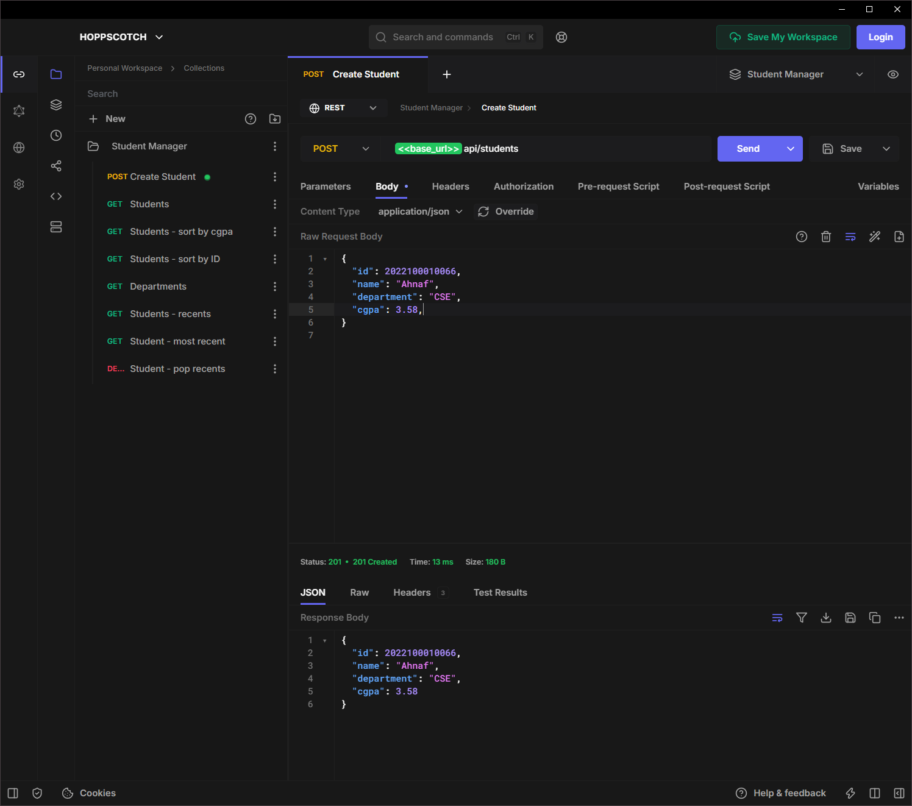
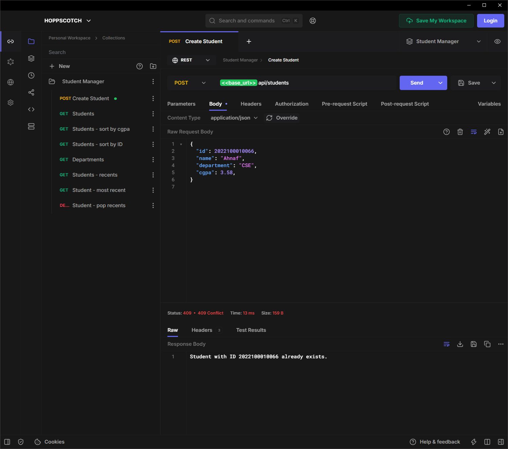
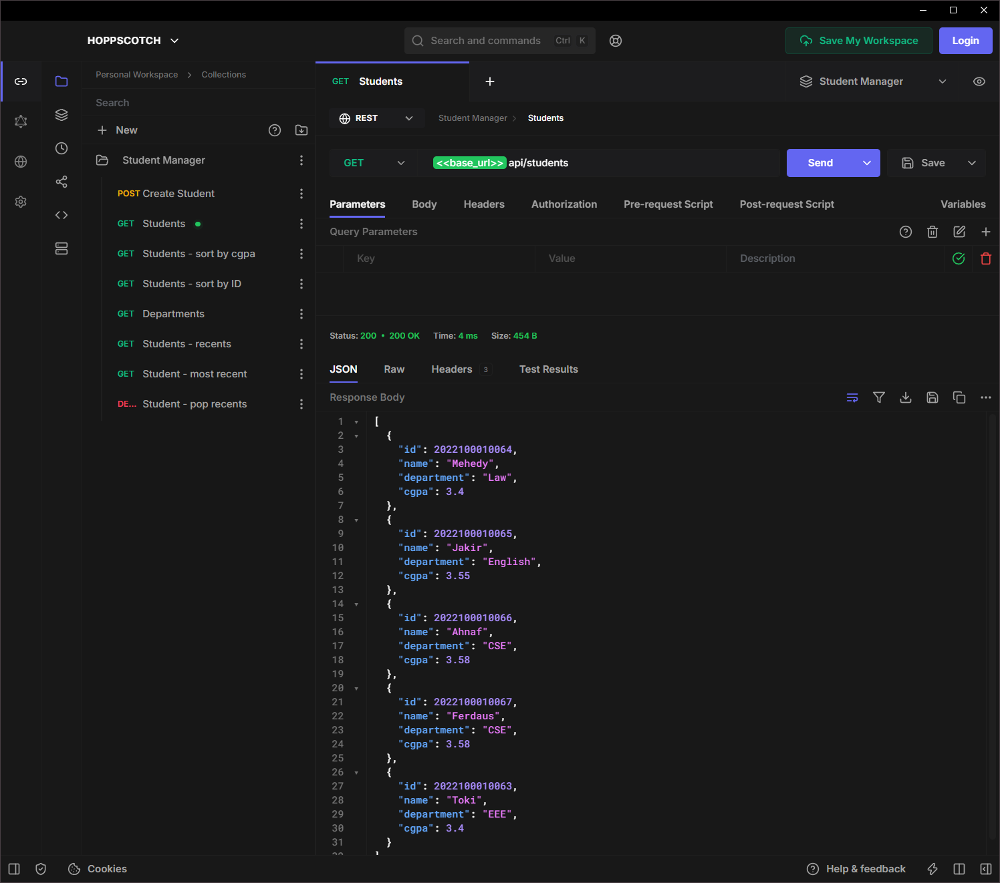
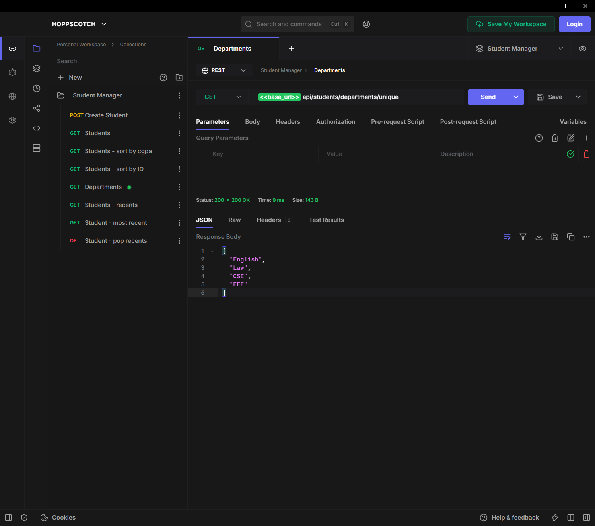

# Student Management System (Collections & I/O Assignment)

A Spring Boot-based backend for managing students, providing a RESTful API. This project was specifically designed to demonstrate the practical application of the **Java Collection Framework** and **Java I/O (Serialization)**.

## Features

- **Java Collections Framework**:
  - `ArrayList` for storing all student records in memory.
  - `HashSet` for gathering unique student departments.
  - `Stack` for maintaining a history of the 3 most recently added students.
  - `Iterator` for safe traversal of the student list.
- **Sorting Mechanisms**:
  - `Comparable` implemented to sort students by ID ascending.
  - `Comparator` implemented to sort students by CGPA descending.
- **Java I/O & Serialization**:
  - Uses `ObjectOutputStream` and `ObjectInputStream` (Byte Streams) to save and load the `ArrayList` to a binary file (`students.ser`), allowing data persistence between restarts.
- **Error Handling**: Rejects requests to add duplicate student IDs (returns `409 Conflict`).

## Tech Stack

- **Java**: 17
- **Framework**: Spring Boot 3.4.0
- **Data Storage**: In-memory Collections + File I/O (`.ser` binary file)
- **Tools**: Lombok, Maven Wrapper

## Prerequisites

- JDK 17 installed on your machine.
- Postman (for testing endpoints).

## Getting Started

### Running the Application

You can start the application directly using the Maven Wrapper included in the project. There is no need to manually install Maven.

**On Windows:**

```bash
.\mvnw.cmd spring-boot:run
```

**On Linux/Mac:**

```bash
./mvnw spring-boot:run
```

The application will start up on `http://localhost:8080`.

## API Endpoints

The API is exposed at `http://localhost:8080/api/students`.

### Core Operations

| Method | Endpoint | Description |
|--------|----------|-------------|
| `POST` | `/api/students` | Add a new student (JSON body: `id`, `name`, `department`, `cgpa`) |
| `GET`  | `/api/students` | Retrieve all students (Uses Iterator) |

### Sorting

| Method | Endpoint | Description |
|--------|----------|-------------|
| `GET`  | `/api/students/sort/id` | Retrieve all students sorted by ID ascending |
| `GET`  | `/api/students/sort/cgpa`| Retrieve all students sorted by CGPA descending |

### Additional Collections

| Method | Endpoint | Description |
|--------|----------|-------------|
| `GET`  | `/api/students/departments/unique` | Retrieve a `HashSet` of unique departments |
| `GET`  | `/api/students/recent` | Retrieve the last 3 added students (`Stack`) |
| `GET`  | `/api/students/recent/peek` | Look at the most recently added student |
| `DELETE`| `/api/students/recent/pop` | Remove and return the most recently added student |

### Example Request (Creating a Student)

```bash
curl -X POST http://localhost:8080/api/students \
-H "Content-Type: application/json" \
-d '{"id": 101, "name": "Ahnaf Sakil Mahmud", "department": "CSE", "cgpa": 3.8}'
```

## Project Structure

- `model/Student.java`: The core entity implementing `Serializable` and `Comparable`.
- `model/StudentCgpaComparator.java`: A custom `Comparator` for descending CGPA sorting.
- `service/StudentService.java`: Contains the core business logic, Collection management, and File I/O stream handling.
- `controller/StudentController.java`: The REST API layer exposing endpoints to the client.

## Assignment Documents

- **[report.pdf](./report.pdf)**: The compiled LaTeX assignment report.
- **[report.tex](./report.tex)**: The LaTeX source code for the assignment report.

## Screenshots (Postman Testing)

The following screenshots demonstrate the functionality of all implemented REST API endpoints using Postman:

### 1. Create Student (POST)



### 2. Error Handling - Duplicate ID (409 Conflict)



### 3. View All Students - Iterator (GET)



### 4. Sort by ID - Comparable (GET)


### 5. Sort by CGPA Descending - Comparator (GET)


### 6. Unique Departments - HashSet (GET)



### 7. View Last 3 Students - Stack (GET)


### 8. Peek Most Recent Student - Stack (GET)


### 9. Pop Most Recent Student - Stack (DELETE)


### 10. Stack After Pop Operation


